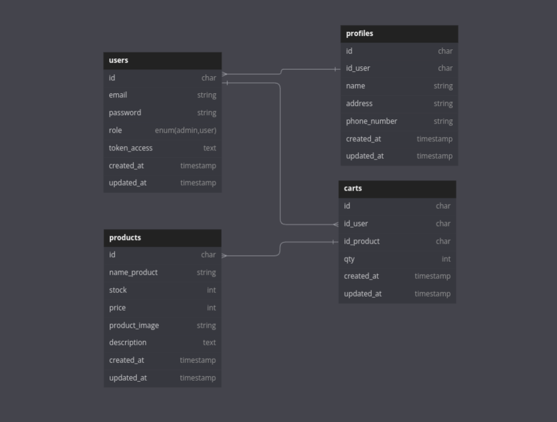

# About
Sistem ini menggunakan Nest.js dengan versi Node 20, dan sudah diatur untuk menggunakan Docker agar lingkungan pengembangan dapat disamakan di semua komputer, termasuk yang tidak memiliki versi Node yang sama.

# ATTENTION
Jangan lupa copy .env.example dan rename menjadi .env kemudian jangan lupa ubah isi dari env sesuai intruksi yang di komentar #

# ERD


# API Documentation
```bash
https://documenter.getpostman.com/view/20628988/2sA3rzJXhK
```

# Installation

```bash
git clone https://github.com/MRizki28/be-e-commers
```

install node_module

```bash
npm install
```

### Migration table and seeder

```bash
prisma migrate dev --name init
```

atau

```bash
npx prisma migrate dev --name init
```

### Run Project

```bash
nest start --watch
```

### Docker
Jika anda menggunakan docker 

```bash
docker-compose up -d
```

Atau

```bash
docker-compose up --build
```

open terminal apps in docker
```bash
docker exec -it e-commers sh
```
setelah berhasil silahkan jalankan command nest/prisma seperti biasa


